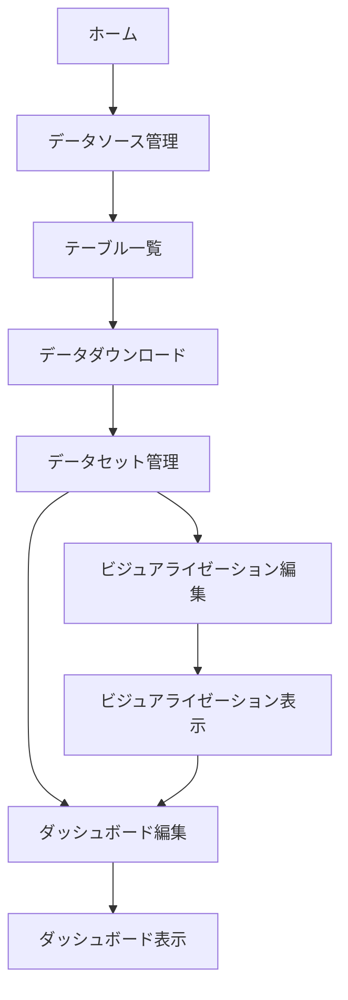

# データ分析アプリケーション要件定義書

## 1. 概要

### 1.1 アプリケーション概要
本アプリケーションはデータ分析のためのアプリケーションです。
サーバーからテーブル一覧を取得して、そのデータをparquet形式でダウンロードすることができます。
ダウンロードしたファイルはduckdbで読み込んでOPFS（Origin Private File System）に保存されます。
そのデータを使って表形式で表示、グラフ表示、複数のグラフ表示が可能です。

### 1.2 主要機能
- テーブル一覧の取得
- データのダウンロード（parquet形式）
- データの保存と管理（OPFS/DuckDB）
- データの表示（表形式）
- グラフ表示（単一/複数）
- ダッシュボード機能

### 1.3 UI構成
- 左サイドバー：ナビゲーションメニュー
- 右側：メインコンテンツエリア
- ページタイプ：編集ページと表示ページ

## 2. アーキテクチャ設計

### 2.1 基本方針
- **DDD（ドメイン駆動設計）**の原則に従う
- **レイヤードアーキテクチャ**を採用
- **DIP（依存関係逆転の原則）**により、ビジネスロジックをフレームワークから独立させる
- フレームワーク非依存（React、Angular、Remixで使用可能）

### 2.2 レイヤー構成

```
┌─────────────────────────────────────────────────┐
│         Presentation Layer (UI)                 │
│  ・View Components                              │
│  ・Controllers/Presenters                       │
│  ・ViewModels                                   │
├─────────────────────────────────────────────────┤
│         Application Layer                       │
│  ・Use Cases                                    │
│  ・Application Services                         │
│  ・DTOs                                         │
├─────────────────────────────────────────────────┤
│         Domain Layer                            │
│  ・Entities                                     │
│  ・Value Objects                                │
│  ・Domain Services                              │
│  ・Repository Interfaces                        │
├─────────────────────────────────────────────────┤
│         Infrastructure Layer                    │
│  ・Repository Implementations                   │
│  ・External Service Adapters                    │
│  ・Database Access (DuckDB/OPFS)               │
└─────────────────────────────────────────────────┘
```

## 3. ドメインモデル

### 3.1 エンティティ

#### DataSource
```typescript
interface DataSource {
  id: DataSourceId;
  name: string;
  type: DataSourceType;
  connectionInfo: ConnectionInfo;
  tables: Table[];
  createdAt: Date;
  updatedAt: Date;
}
```

#### Table
```typescript
interface Table {
  id: TableId;
  name: string;
  schema: TableSchema;
  dataSourceId: DataSourceId;
  lastSyncedAt?: Date;
}
```

#### Dataset
```typescript
interface Dataset {
  id: DatasetId;
  tableId: TableId;
  name: string;
  format: DataFormat;
  location: StorageLocation;
  size: number;
  createdAt: Date;
}
```

#### Visualization
```typescript
interface Visualization {
  id: VisualizationId;
  name: string;
  type: VisualizationType;
  config: VisualizationConfig;
  datasetId: DatasetId;
  createdAt: Date;
  updatedAt: Date;
}
```

#### Dashboard
```typescript
interface Dashboard {
  id: DashboardId;
  name: string;
  layout: DashboardLayout;
  visualizations: Visualization[];
  createdAt: Date;
  updatedAt: Date;
}
```

### 3.2 値オブジェクト

#### DataSourceId
```typescript
class DataSourceId {
  constructor(private readonly value: string) {}
  toString(): string { return this.value; }
}
```

#### TableSchema
```typescript
interface TableSchema {
  columns: Column[];
}

interface Column {
  name: string;
  type: DataType;
  nullable: boolean;
}
```

#### VisualizationConfig
```typescript
interface VisualizationConfig {
  chartType: ChartType;
  xAxis?: AxisConfig;
  yAxis?: AxisConfig;
  filters?: Filter[];
  colors?: ColorScheme;
}
```

### 3.3 列挙型

```typescript
enum DataSourceType {
  DATABASE = 'DATABASE',
  FILE = 'FILE',
  API = 'API'
}

enum DataFormat {
  PARQUET = 'PARQUET',
  CSV = 'CSV',
  JSON = 'JSON'
}

enum VisualizationType {
  TABLE = 'TABLE',
  LINE_CHART = 'LINE_CHART',
  BAR_CHART = 'BAR_CHART',
  PIE_CHART = 'PIE_CHART',
  SCATTER_PLOT = 'SCATTER_PLOT'
}

enum ChartType {
  LINE = 'LINE',
  BAR = 'BAR',
  PIE = 'PIE',
  SCATTER = 'SCATTER',
  AREA = 'AREA'
}
```

## 4. ユースケース

### 4.1 データソース管理

#### GetTableListUseCase
```typescript
interface GetTableListUseCase {
  execute(dataSourceId: DataSourceId): Promise<Table[]>;
}
```

#### ConnectDataSourceUseCase
```typescript
interface ConnectDataSourceUseCase {
  execute(connectionInfo: ConnectionInfo): Promise<DataSource>;
}
```

### 4.2 データ管理

#### DownloadTableDataUseCase
```typescript
interface DownloadTableDataUseCase {
  execute(tableId: TableId): Promise<Dataset>;
}
```

#### LoadDatasetUseCase
```typescript
interface LoadDatasetUseCase {
  execute(datasetId: DatasetId): Promise<QueryableDataset>;
}
```

#### QueryDatasetUseCase
```typescript
interface QueryDatasetUseCase {
  execute(datasetId: DatasetId, query: Query): Promise<QueryResult>;
}
```

### 4.3 ビジュアライゼーション

#### CreateVisualizationUseCase
```typescript
interface CreateVisualizationUseCase {
  execute(params: CreateVisualizationParams): Promise<Visualization>;
}
```

#### UpdateVisualizationUseCase
```typescript
interface UpdateVisualizationUseCase {
  execute(id: VisualizationId, config: VisualizationConfig): Promise<Visualization>;
}
```

#### RenderVisualizationUseCase
```typescript
interface RenderVisualizationUseCase {
  execute(visualization: Visualization, data: QueryResult): Promise<RenderResult>;
}
```

### 4.4 ダッシュボード

#### CreateDashboardUseCase
```typescript
interface CreateDashboardUseCase {
  execute(params: CreateDashboardParams): Promise<Dashboard>;
}
```

#### AddVisualizationToDashboardUseCase
```typescript
interface AddVisualizationToDashboardUseCase {
  execute(dashboardId: DashboardId, visualizationId: VisualizationId, position: Position): Promise<Dashboard>;
}
```

## 5. リポジトリインターフェース

### 5.1 ドメインリポジトリ

```typescript
interface DataSourceRepository {
  findById(id: DataSourceId): Promise<DataSource | null>;
  findAll(): Promise<DataSource[]>;
  save(dataSource: DataSource): Promise<void>;
  delete(id: DataSourceId): Promise<void>;
}

interface TableRepository {
  findById(id: TableId): Promise<Table | null>;
  findByDataSourceId(dataSourceId: DataSourceId): Promise<Table[]>;
  save(table: Table): Promise<void>;
}

interface DatasetRepository {
  findById(id: DatasetId): Promise<Dataset | null>;
  findByTableId(tableId: TableId): Promise<Dataset[]>;
  save(dataset: Dataset): Promise<void>;
  delete(id: DatasetId): Promise<void>;
}

interface VisualizationRepository {
  findById(id: VisualizationId): Promise<Visualization | null>;
  findByDatasetId(datasetId: DatasetId): Promise<Visualization[]>;
  save(visualization: Visualization): Promise<void>;
  delete(id: VisualizationId): Promise<void>;
}

interface DashboardRepository {
  findById(id: DashboardId): Promise<Dashboard | null>;
  findAll(): Promise<Dashboard[]>;
  save(dashboard: Dashboard): Promise<void>;
  delete(id: DashboardId): Promise<void>;
}
```

## 6. ドメインサービス

### 6.1 データ処理サービス

```typescript
interface DataProcessingService {
  convertToParquet(data: RawData): Promise<ParquetData>;
  validateSchema(schema: TableSchema, data: RawData): ValidationResult;
}
```

### 6.2 クエリサービス

```typescript
interface QueryService {
  executeQuery(dataset: Dataset, query: Query): Promise<QueryResult>;
  validateQuery(query: Query, schema: TableSchema): ValidationResult;
}
```

## 7. インフラストラクチャインターフェース

### 7.1 ストレージサービス

```typescript
interface StorageService {
  save(key: string, data: Blob): Promise<StorageLocation>;
  load(location: StorageLocation): Promise<Blob>;
  delete(location: StorageLocation): Promise<void>;
  exists(location: StorageLocation): Promise<boolean>;
}
```

### 7.2 データベースサービス

```typescript
interface DatabaseService {
  connect(connectionInfo: ConnectionInfo): Promise<DatabaseConnection>;
  disconnect(connection: DatabaseConnection): Promise<void>;
  getTables(connection: DatabaseConnection): Promise<TableInfo[]>;
  executeQuery(connection: DatabaseConnection, query: string): Promise<QueryResult>;
}
```

### 7.3 DuckDBサービス

```typescript
interface DuckDBService {
  initialize(): Promise<void>;
  loadParquet(location: StorageLocation): Promise<DuckDBTable>;
  query(sql: string): Promise<QueryResult>;
  close(): Promise<void>;
}
```

### 7.4 HTTPクライアントサービス

```typescript
interface HttpClient {
  get<T>(url: string, options?: RequestOptions): Promise<T>;
  post<T>(url: string, body: any, options?: RequestOptions): Promise<T>;
  put<T>(url: string, body: any, options?: RequestOptions): Promise<T>;
  delete<T>(url: string, options?: RequestOptions): Promise<T>;
}

interface RequestOptions {
  headers?: Record<string, string>;
  params?: Record<string, string>;
  timeout?: number;
}
```

## 8. アプリケーションサービス

### 8.1 データ同期サービス

```typescript
interface DataSyncService {
  syncTable(tableId: TableId): Promise<SyncResult>;
  scheduleSync(tableId: TableId, schedule: SyncSchedule): Promise<void>;
  getSyncStatus(tableId: TableId): Promise<SyncStatus>;
}
```

### 8.2 エクスポートサービス

```typescript
interface ExportService {
  exportVisualization(visualizationId: VisualizationId, format: ExportFormat): Promise<Blob>;
  exportDashboard(dashboardId: DashboardId, format: ExportFormat): Promise<Blob>;
}
```

## 9. ビジネスルール

### 9.1 データ管理ルール
- 同一テーブルに対して複数のデータセットを作成可能
- データセットは作成後は不変（イミュータブル）
- 古いデータセットは自動的にクリーンアップ（設定可能な保持期間）

### 9.2 ビジュアライゼーションルール
- 1つのビジュアライゼーションは1つのデータセットにのみ依存
- ビジュアライゼーションタイプに応じた必須設定項目の検証
- グラフのY軸は複数選択可能（チャートタイプによる）

### 9.3 ダッシュボードルール
- 1つのダッシュボードに複数のビジュアライゼーションを配置可能
- ビジュアライゼーションの重複配置は不可
- レイアウトはグリッドシステムに基づく

## 10. 技術要件

### 10.1 パフォーマンス要件
- 大規模データセット（100万行以上）の処理に対応
- クエリ実行時間：5秒以内（95パーセンタイル）
- UI応答時間：100ms以内

### 10.2 セキュリティ要件
- データソース接続情報の暗号化
- OPFSを使用したブラウザ内でのセキュアなデータ保存
- クロスオリジンリクエストの適切な制御

### 10.3 互換性要件
- モダンブラウザ対応（Chrome、Firefox、Safari、Edge の最新2バージョン）
- OPFS API対応ブラウザ必須
- WebAssembly対応（DuckDB実行のため）

## 11. 制約事項

### 11.1 技術的制約
- フロントエンド完結型（POC段階）
- ブラウザのメモリ制限内での動作
- OPFSのストレージ容量制限

### 11.2 機能的制約
- リアルタイムデータ更新は非対応
- 複数ユーザー間でのデータ共有は非対応（ローカル環境のみ）
- バックエンドサーバーは将来的な拡張として想定

## 12. 非機能要件

### 12.1 可用性
- ブラウザのリロード後もデータセットは保持
- オフライン時も保存済みデータの閲覧は可能

### 12.2 保守性
- フレームワーク非依存の設計
- 各レイヤーの責務を明確に分離
- 単体テスト可能な設計

### 12.3 拡張性
- 新しいビジュアライゼーションタイプの追加が容易
- 新しいデータソースタイプの追加が容易
- バックエンドサービスへの移行が容易

## 13. マイルストーン

### Phase 1: POC（現在）
- フロントエンドのみの実装
- 基本的なデータ取得と表示機能
- 単一グラフ表示

### Phase 2: MVP
- 複数グラフ対応
- ダッシュボード機能
- データ永続化の改善

### Phase 3: Production
- バックエンドサービスの追加
- マルチユーザー対応
- リアルタイムデータ更新

## 14. 用語定義

| 用語 | 説明 |
|------|------|
| OPFS | Origin Private File System - ブラウザのプライベートファイルシステム |
| DuckDB | ブラウザ上で動作する分析用データベース |
| Parquet | カラムナ型のデータ保存形式 |
| Dataset | テーブルデータのスナップショット |
| Visualization | データの視覚的表現（グラフ、表など） |
| Dashboard | 複数のVisualizationを組み合わせた画面 |

## 15. 依存関係の管理

### 15.1 依存の方向
```
Presentation → Application → Domain ← Infrastructure
```

### 15.2 依存性注入
- すべての外部依存はインターフェースを通じて注入
- フレームワーク固有の実装は Presentation Layer と Infrastructure Layer に限定
- Domain Layer は純粋なビジネスロジックのみを含む

### 15.3 アダプターパターン
- 外部ライブラリ（DuckDB、Chart.jsなど）はアダプター経由で使用
- フレームワーク切り替え時はアダプターのみを変更

## 16. フレームワーク別実装ガイド

### 16.1 HTTPクライアント実装

#### Angular
```typescript
// infrastructure/http/AngularHttpClient.ts
import { HttpClient as NgHttpClient } from '@angular/common/http';
import { Injectable } from '@angular/core';
import { lastValueFrom } from 'rxjs';

@Injectable()
export class AngularHttpClient implements HttpClient {
  constructor(private http: NgHttpClient) {}

  async get<T>(url: string, options?: RequestOptions): Promise<T> {
    return lastValueFrom(this.http.get<T>(url, this.buildOptions(options)));
  }

  async post<T>(url: string, body: any, options?: RequestOptions): Promise<T> {
    return lastValueFrom(this.http.post<T>(url, body, this.buildOptions(options)));
  }

  // put, delete メソッドも同様に実装
}
```

#### React / Remix
```typescript
// infrastructure/http/FetchHttpClient.ts
export class FetchHttpClient implements HttpClient {
  async get<T>(url: string, options?: RequestOptions): Promise<T> {
    const response = await fetch(url, {
      method: 'GET',
      headers: options?.headers,
      signal: this.createAbortSignal(options?.timeout)
    });
    
    if (!response.ok) {
      throw new Error(`HTTP error! status: ${response.status}`);
    }
    
    return response.json();
  }

  async post<T>(url: string, body: any, options?: RequestOptions): Promise<T> {
    const response = await fetch(url, {
      method: 'POST',
      headers: {
        'Content-Type': 'application/json',
        ...options?.headers
      },
      body: JSON.stringify(body),
      signal: this.createAbortSignal(options?.timeout)
    });
    
    if (!response.ok) {
      throw new Error(`HTTP error! status: ${response.status}`);
    }
    
    return response.json();
  }

  // put, delete メソッドも同様に実装

  private createAbortSignal(timeout?: number): AbortSignal | undefined {
    if (!timeout) return undefined;
    
    const controller = new AbortController();
    setTimeout(() => controller.abort(), timeout);
    return controller.signal;
  }
}
```

### 16.2 依存性注入の実装例

#### Angular
```typescript
// app.module.ts
import { HttpClient } from '@angular/common/http';

@NgModule({
  providers: [
    { provide: 'HttpClient', useClass: AngularHttpClient },
    // その他のサービス
  ]
})
export class AppModule {}
```

#### React / Remix
```typescript
// di/container.ts
import { FetchHttpClient } from '../infrastructure/http/FetchHttpClient';

export const container = {
  httpClient: new FetchHttpClient(),
  // その他のサービス
};
```

### 16.3 実装上の注意点

1. **Axiosの使用を避ける**: 各フレームワークの標準的なHTTPクライアントを使用
   - Angular: HttpClient
   - React/Remix: Fetch API

2. **エラーハンドリング**: フレームワーク固有のエラー処理を抽象化

3. **型安全性**: TypeScriptの型システムを活用してインターフェースを厳密に定義

4. **テスタビリティ**: HTTPクライアントはモック可能な設計にする

## 17. UI/UX詳細仕様

### 17.1 画面構成

#### メインレイアウト
```
┌─────────────────────────────────────────────────────────┐
│  Header (アプリケーションタイトル、ユーザー情報)            │
├────────────┬────────────────────────────────────────────┤
│            │                                            │
│   Side     │                                            │
│   Menu     │           Main Content Area               │
│            │                                            │
│  ・データ    │                                            │
│    ソース   │                                            │
│  ・テーブル  │                                            │
│  ・ビジュア  │                                            │
│    ライズ   │                                            │
│  ・ダッシュ  │                                            │
│    ボード   │                                            │
│            │                                            │
└────────────┴────────────────────────────────────────────┘
```

### 17.2 画面一覧

#### 1. データソース管理画面
- **パス**: `/datasources`
- **機能**:
  - データソース一覧表示
  - 新規データソース追加
  - 接続テスト
  - データソース削除

#### 2. テーブル一覧画面
- **パス**: `/datasources/:id/tables`
- **機能**:
  - テーブル一覧表示
  - テーブル検索・フィルタリング
  - スキーマ情報表示
  - データダウンロード開始

#### 3. データセット管理画面
- **パス**: `/datasets`
- **機能**:
  - ダウンロード済みデータセット一覧
  - データセット詳細情報
  - データプレビュー（最初の100行）
  - データセット削除

#### 4. ビジュアライゼーション編集画面
- **パス**: `/visualizations/new` または `/visualizations/:id/edit`
- **機能**:
  - データセット選択
  - グラフタイプ選択
  - 軸設定（X軸、Y軸）
  - フィルター設定
  - リアルタイムプレビュー
  - 保存

#### 5. ビジュアライゼーション表示画面
- **パス**: `/visualizations/:id`
- **機能**:
  - グラフ表示
  - データテーブル表示切り替え
  - エクスポート（PNG、CSV）
  - 編集画面への遷移

#### 6. ダッシュボード編集画面
- **パス**: `/dashboards/new` または `/dashboards/:id/edit`
- **機能**:
  - グリッドレイアウトエディタ
  - ビジュアライゼーション追加・配置
  - サイズ調整
  - 保存

#### 7. ダッシュボード表示画面
- **パス**: `/dashboards/:id`
- **機能**:
  - 複数ビジュアライゼーション表示
  - 自動リフレッシュ（オプション）
  - フルスクリーンモード
  - 編集画面への遷移

### 17.3 画面遷移フロー



### 17.4 UIコンポーネント仕様

#### 共通コンポーネント
1. **Button**: プライマリ、セカンダリ、デンジャー
2. **Input**: テキスト、数値、日付
3. **Select**: 単一選択、複数選択
4. **Table**: ソート、ページネーション、フィルター
5. **Modal**: 確認、フォーム、情報表示
6. **Toast**: 成功、エラー、警告、情報
7. **Loading**: スピナー、プログレスバー
8. **Card**: 情報表示用カード
9. **Chart**: Line、Bar、Pie、Scatter、Area

## 18. データフローと状態管理

### 18.1 アプリケーション状態

```typescript
interface AppState {
  datasources: {
    list: DataSource[];
    selected: DataSource | null;
    loading: boolean;
    error: Error | null;
  };
  tables: {
    list: Table[];
    selected: Table | null;
    loading: boolean;
    error: Error | null;
  };
  datasets: {
    list: Dataset[];
    selected: Dataset | null;
    loading: boolean;
    error: Error | null;
  };
  visualizations: {
    list: Visualization[];
    selected: Visualization | null;
    editing: VisualizationDraft | null;
    loading: boolean;
    error: Error | null;
  };
  dashboards: {
    list: Dashboard[];
    selected: Dashboard | null;
    editing: DashboardDraft | null;
    loading: boolean;
    error: Error | null;
  };
  ui: {
    sidebarOpen: boolean;
    theme: 'light' | 'dark';
    locale: string;
  };
}
```

### 18.2 データフロー

#### データソースからビジュアライゼーションまでの流れ
1. **データソース接続**
   - ユーザーが接続情報を入力
   - 接続テスト実行
   - 成功したら保存

2. **テーブル選択とダウンロード**
   - テーブル一覧から選択
   - ダウンロードオプション設定
   - Parquet形式でダウンロード
   - OPFSに保存

3. **データセット作成**
   - DuckDBでParquetファイルを読み込み
   - メタデータ生成
   - データセットとして登録

4. **ビジュアライゼーション作成**
   - データセット選択
   - グラフタイプ選択
   - 軸とオプション設定
   - プレビュー確認
   - 保存

5. **ダッシュボード作成**
   - ビジュアライゼーション選択
   - レイアウト配置
   - 保存

### 18.3 状態管理パターン

#### フレームワーク別実装
- **Angular**: RxJS + NgRx または Akita
- **React**: Context API + useReducer または Redux Toolkit
- **Remix**: Loader/Action + Session Storage

## 19. モックデータとサンプルデータ

### 19.1 モックデータソース

```typescript
export const mockDataSources: DataSource[] = [
  {
    id: new DataSourceId('ds-001'),
    name: 'Sales Database',
    type: DataSourceType.DATABASE,
    connectionInfo: {
      host: 'localhost',
      port: 5432,
      database: 'sales_db',
      username: 'demo_user'
    },
    tables: [],
    createdAt: new Date('2024-01-01'),
    updatedAt: new Date('2024-01-01')
  },
  {
    id: new DataSourceId('ds-002'),
    name: 'Analytics API',
    type: DataSourceType.API,
    connectionInfo: {
      baseUrl: 'https://api.example.com/analytics',
      apiKey: 'demo-api-key'
    },
    tables: [],
    createdAt: new Date('2024-01-02'),
    updatedAt: new Date('2024-01-02')
  }
];
```

### 19.2 サンプルテーブルデータ

```typescript
export const sampleTables: Table[] = [
  {
    id: new TableId('tbl-001'),
    name: 'sales_transactions',
    schema: {
      columns: [
        { name: 'id', type: DataType.INTEGER, nullable: false },
        { name: 'date', type: DataType.DATE, nullable: false },
        { name: 'product_id', type: DataType.INTEGER, nullable: false },
        { name: 'quantity', type: DataType.INTEGER, nullable: false },
        { name: 'price', type: DataType.DECIMAL, nullable: false },
        { name: 'customer_id', type: DataType.INTEGER, nullable: true }
      ]
    },
    dataSourceId: new DataSourceId('ds-001'),
    lastSyncedAt: new Date('2024-01-15')
  }
];
```

### 19.3 サンプルビジュアライゼーション設定

```typescript
export const sampleVisualizations: Visualization[] = [
  {
    id: new VisualizationId('viz-001'),
    name: '月別売上推移',
    type: VisualizationType.LINE_CHART,
    config: {
      chartType: ChartType.LINE,
      xAxis: {
        field: 'date',
        label: '日付',
        format: 'YYYY-MM'
      },
      yAxis: {
        field: 'total_sales',
        label: '売上高',
        format: 'currency'
      }
    },
    datasetId: new DatasetId('ds-001'),
    createdAt: new Date('2024-01-20'),
    updatedAt: new Date('2024-01-20')
  }
];
```

## 20. 開発環境セットアップ

### 20.1 必要な環境

- Node.js 18.x以上
- npm 9.x以上 または yarn 1.22.x以上
- モダンブラウザ（Chrome 90+、Firefox 88+、Safari 14+、Edge 90+）

### 20.2 プロジェクト構造

```
project-root/
├── package.json
├── tsconfig.json
├── README.md
├── src/
│   ├── domain/
│   │   ├── entities/
│   │   ├── value-objects/
│   │   ├── repositories/
│   │   └── services/
│   ├── application/
│   │   ├── usecases/
│   │   ├── services/
│   │   └── dtos/
│   ├── infrastructure/
│   │   ├── repositories/
│   │   ├── http/
│   │   ├── storage/
│   │   └── database/
│   └── presentation/
│       ├── components/
│       ├── pages/
│       ├── hooks/
│       └── utils/
├── tests/
├── public/
└── dist/
```

### 20.3 開発用スクリプト

```json
{
  "scripts": {
    "dev": "vite",
    "build": "tsc && vite build",
    "preview": "vite preview",
    "test": "jest",
    "test:watch": "jest --watch",
    "lint": "eslint src/**/*.ts",
    "format": "prettier --write src/**/*.ts"
  }
}
```

### 20.4 初期セットアップ手順

1. **リポジトリのクローン**
   ```bash
   git clone <repository-url>
   cd <project-name>
   ```

2. **依存関係のインストール**
   ```bash
   npm install
   ```

3. **開発サーバーの起動**
   ```bash
   npm run dev
   ```

4. **ブラウザでアクセス**
   ```
   http://localhost:3000
   ```

### 20.5 モック環境での動作確認

開発環境では以下のモック機能が利用可能：

1. **モックHTTPサーバー**: MSW (Mock Service Worker)を使用
2. **モックデータ**: 事前定義されたサンプルデータ
3. **モックストレージ**: IndexedDBを使用したOPFSのシミュレーション
4. **モックDuckDB**: サンプルクエリ結果を返すモック実装

### 20.6 環境変数

```env
# .env.development
VITE_API_BASE_URL=http://localhost:3000/api
VITE_MOCK_MODE=true
VITE_MOCK_DELAY=500
VITE_LOG_LEVEL=debug
```

## 21. デフォルト動作とモックサーバー設定

### 21.1 初回起動時のデフォルト動作

1. **ホーム画面表示**
   - アプリケーション概要
   - クイックスタートガイド
   - サンプルデータへのアクセス

2. **サンプルデータの自動ロード**
   - モックデータソース2件を自動登録
   - 各データソースに3-5個のテーブルを事前定義
   - サンプルデータセット3件を自動生成

3. **デモモード表示**
   - 画面上部に「デモモード」バナー表示
   - 実際のデータソース接続は無効化
   - すべての操作はモックデータで実行

### 21.2 モックサーバー実装

#### MSW (Mock Service Worker) 設定
```typescript
// src/mocks/handlers.ts
import { rest } from 'msw';

export const handlers = [
  // データソース一覧取得
  rest.get('/api/datasources', (req, res, ctx) => {
    return res(
      ctx.delay(300),
      ctx.status(200),
      ctx.json(mockDataSources)
    );
  }),

  // テーブル一覧取得
  rest.get('/api/datasources/:id/tables', (req, res, ctx) => {
    const { id } = req.params;
    return res(
      ctx.delay(500),
      ctx.status(200),
      ctx.json(getTablesForDataSource(id))
    );
  }),

  // データダウンロード（モック）
  rest.post('/api/tables/:id/download', (req, res, ctx) => {
    return res(
      ctx.delay(2000), // ダウンロードをシミュレート
      ctx.status(200),
      ctx.json({
        datasetId: generateDatasetId(),
        location: 'opfs://datasets/sample-data.parquet',
        size: 1024 * 1024 * 5 // 5MB
      })
    );
  }),

  // ビジュアライゼーションデータ取得
  rest.get('/api/datasets/:id/query', (req, res, ctx) => {
    return res(
      ctx.delay(800),
      ctx.status(200),
      ctx.json(generateChartData(req.url.searchParams))
    );
  })
];
```

### 21.3 サンプルデータ生成

```typescript
// src/mocks/data-generators.ts

export function generateSalesData(rows: number = 1000): any[] {
  const data = [];
  const startDate = new Date('2023-01-01');
  
  for (let i = 0; i < rows; i++) {
    const date = new Date(startDate);
    date.setDate(date.getDate() + i);
    
    data.push({
      id: i + 1,
      date: date.toISOString().split('T')[0],
      product_id: Math.floor(Math.random() * 50) + 1,
      quantity: Math.floor(Math.random() * 100) + 1,
      price: Math.round((Math.random() * 1000 + 10) * 100) / 100,
      customer_id: Math.floor(Math.random() * 200) + 1,
      region: ['North', 'South', 'East', 'West'][Math.floor(Math.random() * 4)],
      category: ['Electronics', 'Clothing', 'Food', 'Books'][Math.floor(Math.random() * 4)]
    });
  }
  
  return data;
}

export function generateChartData(params: URLSearchParams): ChartData {
  const chartType = params.get('chartType');
  const xField = params.get('xField');
  const yField = params.get('yField');
  
  // チャートタイプに応じたデータ生成
  switch (chartType) {
    case 'line':
      return generateLineChartData(xField, yField);
    case 'bar':
      return generateBarChartData(xField, yField);
    case 'pie':
      return generatePieChartData(yField);
    default:
      return generateTableData();
  }
}
```

### 21.4 モックDuckDB実装

```typescript
// src/infrastructure/database/MockDuckDBService.ts

export class MockDuckDBService implements DuckDBService {
  private mockData: Map<string, any[]> = new Map();

  async initialize(): Promise<void> {
    console.log('Mock DuckDB initialized');
    // サンプルデータをメモリに読み込み
    this.mockData.set('sales_transactions', generateSalesData(10000));
  }

  async loadParquet(location: StorageLocation): Promise<DuckDBTable> {
    // Parquetファイルのロードをシミュレート
    return {
      name: 'loaded_table',
      rowCount: 10000,
      columns: [
        { name: 'id', type: 'INTEGER' },
        { name: 'date', type: 'DATE' },
        { name: 'product_id', type: 'INTEGER' },
        { name: 'quantity', type: 'INTEGER' },
        { name: 'price', type: 'DECIMAL' },
        { name: 'customer_id', type: 'INTEGER' }
      ]
    };
  }

  async query(sql: string): Promise<QueryResult> {
    console.log('Executing mock query:', sql);
    
    // 簡単なSQLパースとモックレスポンス生成
    if (sql.toLowerCase().includes('select count(*)')) {
      return {
        columns: [{ name: 'count', type: 'INTEGER' }],
        rows: [[10000]],
        rowCount: 1
      };
    }
    
    if (sql.toLowerCase().includes('group by')) {
      return this.generateAggregatedData(sql);
    }
    
    // デフォルトレスポンス
    return {
      columns: this.getColumnsFromSQL(sql),
      rows: this.mockData.get('sales_transactions')?.slice(0, 100) || [],
      rowCount: 100
    };
  }

  async close(): Promise<void> {
    console.log('Mock DuckDB closed');
    this.mockData.clear();
  }

  private generateAggregatedData(sql: string): QueryResult {
    // GROUP BY クエリのモックデータ生成
    const months = ['2023-01', '2023-02', '2023-03', '2023-04', '2023-05', '2023-06'];
    const data = months.map((month, index) => ({
      month,
      total_sales: Math.round((50000 + Math.random() * 50000) * 100) / 100,
      transaction_count: 150 + Math.floor(Math.random() * 100)
    }));

    return {
      columns: [
        { name: 'month', type: 'VARCHAR' },
        { name: 'total_sales', type: 'DECIMAL' },
        { name: 'transaction_count', type: 'INTEGER' }
      ],
      rows: data,
      rowCount: data.length
    };
  }

  private getColumnsFromSQL(sql: string): Column[] {
    // 簡易的なSQLパーサー
    const selectMatch = sql.match(/SELECT\s+(.+?)\s+FROM/i);
    if (!selectMatch) return [];

    const fields = selectMatch[1].split(',').map(f => f.trim());
    return fields.map(field => ({
      name: field.replace(/.*\s+as\s+/i, ''),
      type: 'VARCHAR'
    }));
  }
}
```

### 21.5 開発時の動作フロー

1. **`npm run dev` 実行時**
   ```
   [起動]
   ↓
   [MSW初期化] → モックサーバー起動
   ↓
   [モックDuckDB初期化] → サンプルデータ生成
   ↓
   [アプリケーション起動] → http://localhost:3000
   ↓
   [デモデータ表示] → 即座に操作可能
   ```

2. **ユーザー操作の流れ**
   - データソース一覧 → モックデータ2件表示
   - テーブル選択 → 各5テーブル表示
   - データダウンロード → 2秒後に完了（モック）
   - グラフ作成 → 即座にサンプルデータでプレビュー
   - ダッシュボード作成 → 複数グラフを配置可能

### 21.6 モックストレージ実装

```typescript
// src/infrastructure/storage/MockStorageService.ts

export class MockStorageService implements StorageService {
  private storage: Map<string, Blob> = new Map();

  async save(key: string, data: Blob): Promise<StorageLocation> {
    this.storage.set(key, data);
    return {
      type: 'mock',
      path: `mock://storage/${key}`,
      size: data.size
    };
  }

  async load(location: StorageLocation): Promise<Blob> {
    const key = location.path.replace('mock://storage/', '');
    const data = this.storage.get(key);
    
    if (!data) {
      // モックParquetデータを生成
      return new Blob([generateMockParquetData()], {
        type: 'application/octet-stream'
      });
    }
    
    return data;
  }

  async delete(location: StorageLocation): Promise<void> {
    const key = location.path.replace('mock://storage/', '');
    this.storage.delete(key);
  }

  async exists(location: StorageLocation): Promise<boolean> {
    const key = location.path.replace('mock://storage/', '');
    return this.storage.has(key);
  }
}
```

### 21.7 開発用ユーティリティ

```typescript
// src/utils/dev-tools.ts

export const DevTools = {
  // データリセット
  resetData: () => {
    localStorage.clear();
    indexedDB.deleteDatabase('app-data');
    window.location.reload();
  },

  // サンプルデータ再生成
  regenerateSampleData: () => {
    const newData = generateSalesData(5000);
    console.log('Generated new sample data:', newData.length, 'rows');
  },

  // パフォーマンス測定
  measureQuery: async (query: string) => {
    const start = performance.now();
    const result = await mockDuckDB.query(query);
    const end = performance.now();
    console.log(`Query executed in ${end - start}ms`, result);
  },

  // デバッグ情報表示
  showDebugInfo: () => {
    console.log('App State:', store.getState());
    console.log('Mock Data:', mockDataSources);
    console.log('Storage Usage:', navigator.storage.estimate());
  }
};

// 開発環境でのみグローバルに公開
if (import.meta.env.DEV) {
  (window as any).DevTools = DevTools;
}
```